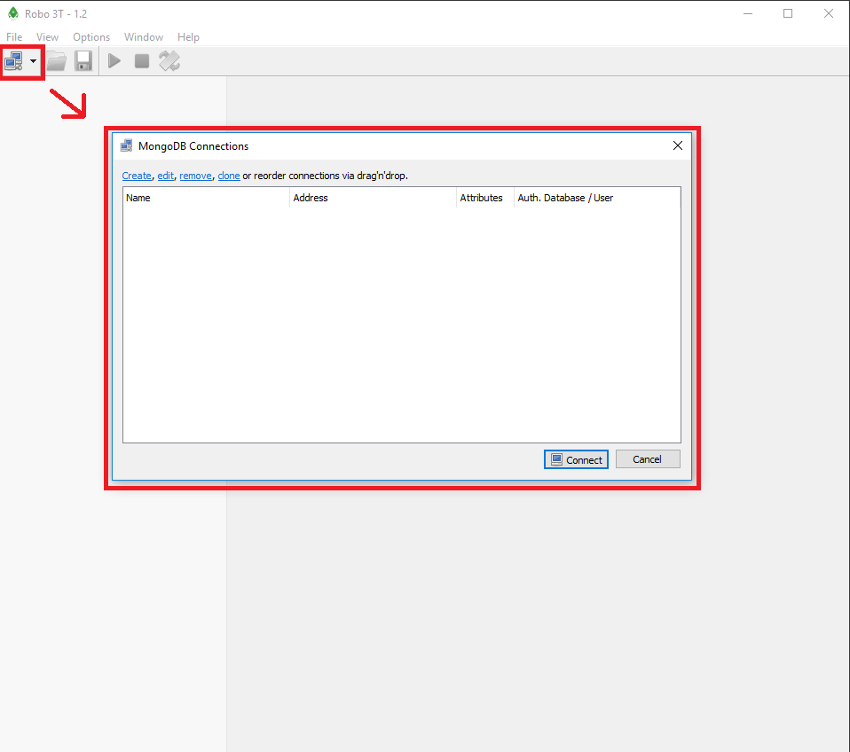
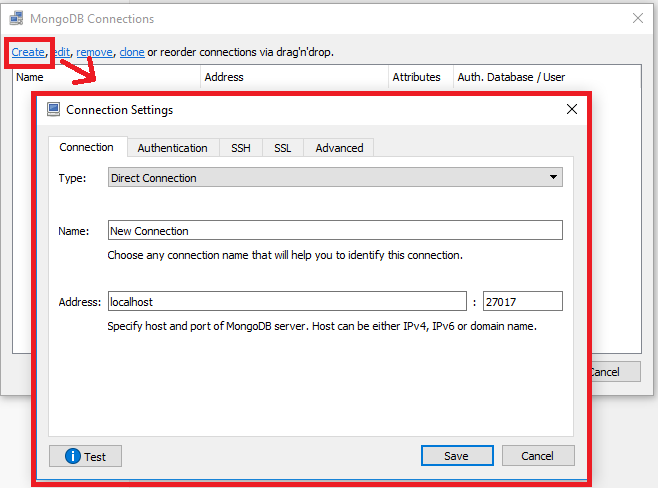

# PTUT-MEAN

## Récupération du projet PTUT-MEAN :
    Si vous récupérez le projet via Moodle :
 - Dézipper le projet et passer à l'installation des logiciels.

    Si vous souhaitez récupérer le projet via Git :
 - Dans une invite de commande Git :
  	`git clone https://gitlab.com/ThibaudLaguerie/ptut-mean.git`

### Naviguer dans le projet et installer les packages du projet (à l'aide du cmd ou de GitBash):
 - Ouvrir le projet dans Visual Studio Code et ouvrir le terminal de commande intégré dans L'IDE.
    - Taper les commandes suivantes :
     
    `cd ptut-mean/PTUTMEAN`
    
    `npm install`

    Cette commande vous permettra d'installer notamment les packages ExpressJS et Mongoose.

## Logiciel pré-requis:

### IDE Visual Studio Code :
    Constitue l'environnement de développement du projet.
    
 - Télécharger l'IDE en suivant ce lien !:
    
    https://code.visualstudio.com/download

### Node.js :
    Constitue le premier des éléments principaux nécessaires à la création d'une application MEAN.
 - Télécharger et installer la dernière version de Node.js :
 
    https://nodejs.org/en/

### Angular CLI (Command Line Interface) :
    Constitue le deuxième des éléments principaux nécessaires à la création d'une application MEAN.
 - Installation :
    - Ouvrir un nouveau terminal :
        - Taper la commande suivante :
        

Sur Windows : `npm install -g @angular/cli`

Sur Mac et Linux : `sudo npm install -g @angular/cli`

### MongoDB :

    Constitue le troisième des éléments principaux nécessaires à la création d'une application.
    Notre application peut être lié à une base de donnée cloud, ou à une base de donnée local qui se trouve dans la machine utilisée.
    Pour pouvoir utiliser cette dernière, il vous faudra télécharger et installer MongoDB Server (suivre le lien suivant) :

 - Installation

https://www.mongodb.com/download-center/community

    Vous voudrez sûrement consulté votre base de donnée local. Pour cela, nous vous suggérons de télécharger Robo 3T.
    Cette application est un substitut au mongo shell classique. L'interface permet une approche plus simple de la DB locale.

 - Installation

https://robomongo.org/download

 - Connexion à la DB locale

    Suivre le tutoriel présenté ci-dessous en quelques images :
    
    
    
    
    La base de donnée locale MongoDB se trouve toujours sur le port 27017 de la machine.
    
        

    
## Lancement de l'application

    Dans l'invite de commande, et en se positionnant dans le dossier ptut-mean/PTUTMEAN, suivez les instructions suivantes pour lancer l'application suivante.
 - Dans un premier terminal, utiliser la commande suivante permettant de lancer l'interface Angular sur le port localhost:4200 :
 
    `ng serve`
 
 - Ouvrir un second terminal en se servant de l'icone "+" en haut à droite du premier terminal :
 
    Se repositionner dans le dossier ptut-mean/PTUTMEAN si cela n'a pas été conservé et utiliser la commande suivante permettant de lancer l'application NodeJS en back-end :
    
    `npm run start:server`

    
    Si vous observez dans le terminal un message "Connection failed", vous utilisez certainement une connexion bloquant l'accès à la base de donnée sur serveur.
    
 - Dans ce cas là, ouvrir le fichier ptut-mean/PTUTMEAN/backend/app.js :
    
    
    Passer la ligne 9 en commentaires en rajoutant // au début de la ligne et retirer les // au début de la ligne 10. La base de donnée se trouvera maintenant en local.
    
    Taper encore une fois la commande :

    `npm run start:server`

## Ouverture de l'application

 - Sur le moteur de recherche de votre choix, taper :
    
    http://localhost:4200