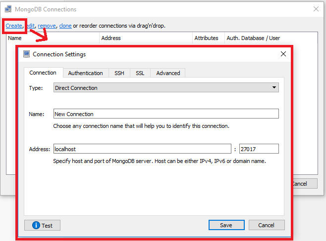

# PTUT-MEAN

## Préparation au développement de l'application E-Commerce MEAN

### Installation de Visual Studio Code

 - Télécharger et installer la dernière version de l'IDE Visual Studio Code (VS Code):
    https://code.visualstudio.com/download

### Préparation du projet
#### Node.js :
    Constitue le premier des éléments principaux nécessaires à la création d'une application MEAN
 - Télécharger et installer la dernière version de Node.js :
    https://nodejs.org/en/

 - Créer un dossier nommé MEAN par exemple,
 - Ouvrir le dossier avec VS Code,
 - Ouvrir une console dans ce dossier ,
 - Dans la console, tapez "npm init", Le fichier package.json sera alors créé,
 - Créer votre fichier app.js d'entrée dans le dossier,
 - Écrire dedans : console.log("NodeJS start");
 - Dans la console : taper "node app.js", normalement "NodeJS start" doit s'afficher.
 

#### Angular CLI (Command Line Interface) :

    Constitue le deuxième des éléments principaux nécessaires à la création d'une application MEAN

 - Installation :
    - Ouvrir un nouveau terminal (inclus dans VS Code) :
        - Taper la commande suivante : 

            Sur Windows : `npm install -g @angular/cli`
            
            Sur Mac et Linux : `sudo npm install -g @angular/cli`

               
            npm signifie Node Package Manager

            -g permet d'installer Angular CLI globalement, c'est-à-dire sur la machine, 
        
        - Taper la commande suivante : `ng new <nomDuProjet>`
            Crée le projet dans un dossier <nomDuProjet> et contiendra tous les fichiers et dossiers nécessaires au lancement de l'application de base.
            
        - Pour lancer le projet, il faut taper la commande : ng serve

##### Importation des packages utilisés dans l'application :
    
    Pour ce faire, reprendre la commande `npm install` vue à la partie précédente.
    
    Taper dans le terminal :
    

`npm install --save <package name>`
        
Il existe une multitude de package pouvant être utilisé dans une application Angular. Voici une liste de ceux utilisés dans notre projet E-Commerce :
        
        
 - @angular/cdk
 - @angular/material
 - body-parser
 - mongoose
 - express
 - nodemon
 - multer
 

#### MongoDB :

    Constitue le troisième des éléments principaux nécessaires à la création d'une application.
    Notre application peut être lié à une base de donnée cloud, ou à une base de donnée local qui se trouve dans la machine utilisée.
    Pour pouvoir utiliser cette dernière, il vous faudra télécharger et installer MongoDB Server (suivre le lien suivant) :

 - Installation

https://www.mongodb.com/download-center/community

    Vous voudrez sûrement consulté votre base de donnée local. Pour cela, nous vous suggérons de télécharger Robo 3T.
    Cette application est un substitut au mongo shell classique. L'interface permet une approche plus simple de la DB locale.

 - Installation

https://robomongo.org/download

 - Connexion à la DB locale

    Suivre le tutoriel présenté ci-dessous en quelques images :
    
    
    
    
    La base de donnée locale MongoDB se trouve toujours sur le port 27017 de la machine.
    
        